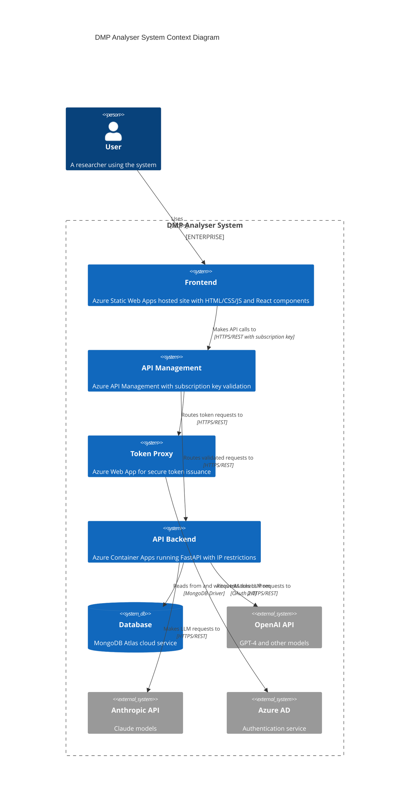
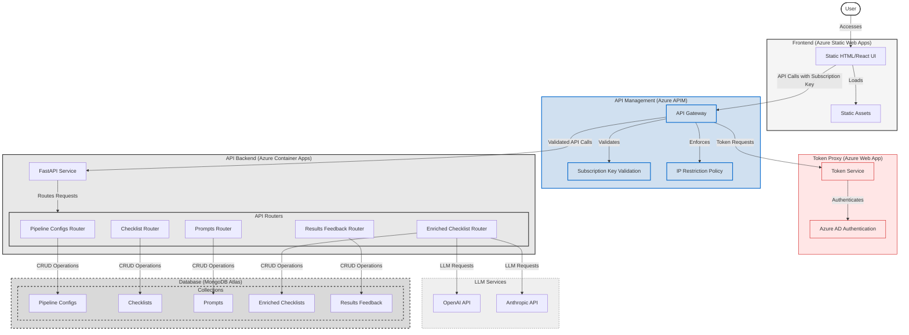
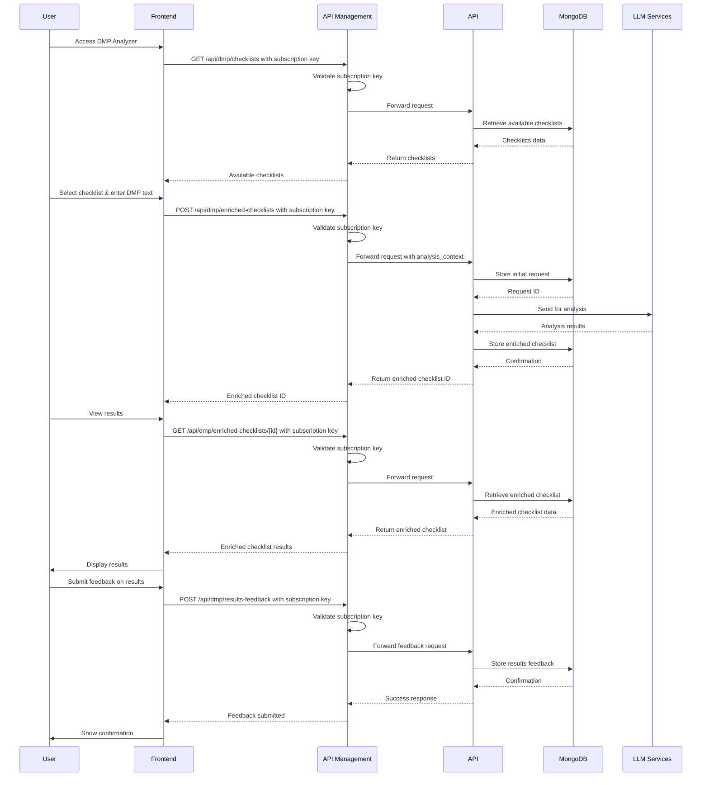

# DMP Analyser Architecture Diagrams

The following diagrams represent the production architecture of the DMP Analyser system, including security measures to protect the API backend.

## C4 Model Diagram

## Mermaid Diagram Code

## Sequence Diagram for DMP Checklist Flow

