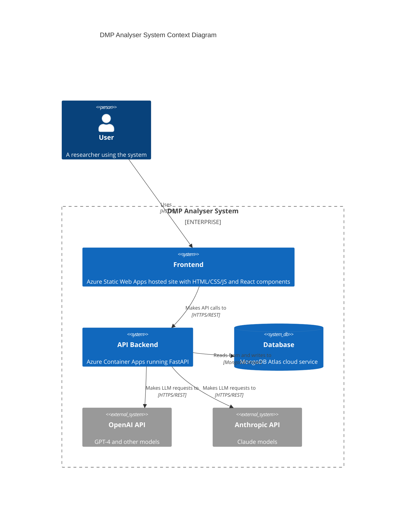
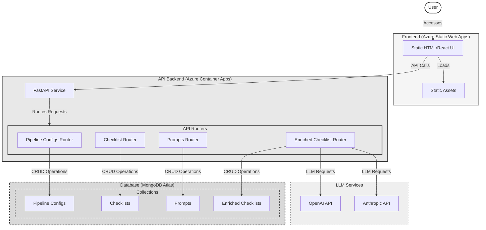
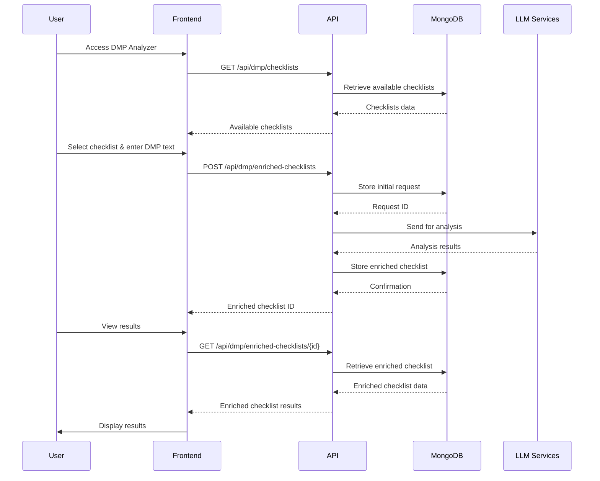

# DMP Analyser Architecture Diagrams

The following diagrams represents the production architecture of the DMP Analyser system.

## C4 Model Diagram

## Mermaid Diagram Code

## Sequence Diagram for DMP Checklist Flow

