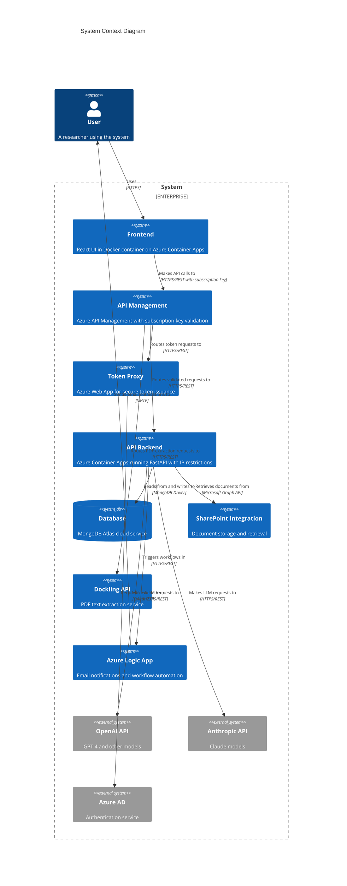
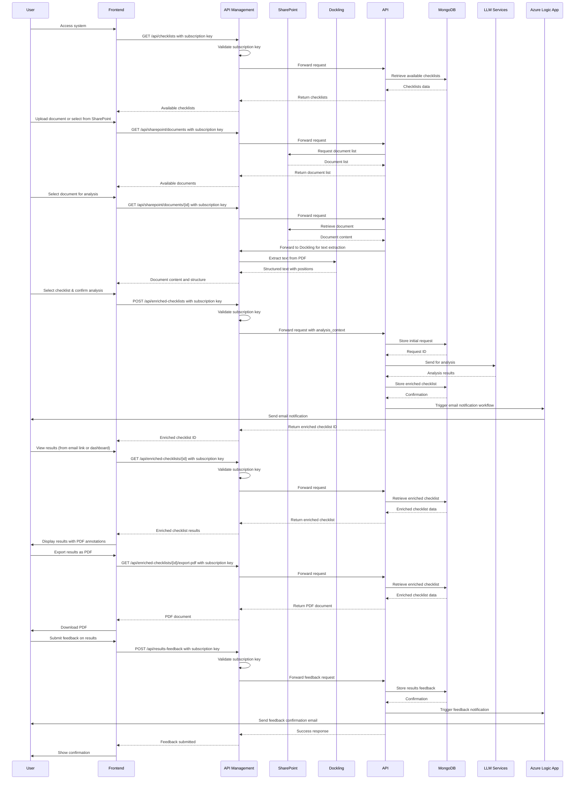

# Architecture Diagrams

The following diagrams represent the production architecture of the system, including security measures to protect the API backend and integrations with external services.

## C4 Model Diagram

## Mermaid Diagram Code

```mermaid
flowchart TB
    %% Define the main components
    User([User])
    
    subgraph Frontend["Frontend (React UI in Azure Container Apps)"]
        UI[React UI Components]
        PDFViewer[PDF Viewer with Annotations]
        StaticAssets[Static Assets]
    end
    
    subgraph APIM["API Management (Azure APIM)"]
        Gateway[API Gateway]
        SubscriptionKey[Subscription Key Validation]
        IPRestriction[IP Restriction Policy]
    end
    
    subgraph TokenProxy["Token Proxy (Azure Web App)"]
        TokenService[Token Service]
        AzureADAuth[Azure AD Authentication]
    end
    
    subgraph SharePoint["SharePoint Integration"]
        SPDocuments[Document Storage]
        GraphAPI[Microsoft Graph API]
    end
    
    subgraph Dockling["Dockling API"]
        PDFExtraction[PDF Text Extraction]
        StructuredText[Structured Text Output]
    end
    
    subgraph LogicApp["Azure Logic App"]
        EmailNotifications[Email Notifications]
        WorkflowAutomation[Workflow Automation]
    end
    
    subgraph API["API Backend (Azure Container Apps)"]
        FastAPI[FastAPI Service]
        subgraph Routers["API Routers"]
            PipelineRouter[Pipeline Configs Router]
            ChecklistRouter[Checklist Router]
            PromptsRouter[Prompts Router]
            EnrichedChecklistRouter[Enriched Checklist Router]
            ResultsFeedbackRouter[Results Feedback Router]
            SharePointRouter[SharePoint Router]
        end
    end
    
    subgraph Database["Database (MongoDB Atlas)"]
        Collections[(Collections)]
        subgraph Collections
            PipelineConfigs[Pipeline Configs]
            Checklists[Checklists]
            Prompts[Prompts]
            EnrichedChecklists[Enriched Checklists]
            ResultsFeedback[Results Feedback]
            DocumentMetadata[Document Metadata]
        end
    end
    
    subgraph LLMServices["LLM Services"]
        OpenAI[OpenAI API]
        Anthropic[Anthropic API]
    end
    
    %% Define the connections
    User -->|Accesses| UI
    UI -->|Displays| PDFViewer
    UI -->|Loads| StaticAssets
    UI -->|API Calls with Subscription Key| Gateway
    
    Gateway -->|Validates| SubscriptionKey
    Gateway -->|Enforces| IPRestriction
    Gateway -->|Token Requests| TokenService
    Gateway -->|Validated API Calls| FastAPI
    Gateway -->|PDF Extraction Requests| PDFExtraction
    
    TokenService -->|Authenticates| AzureADAuth
    
    FastAPI -->|Routes Requests| Routers
    PipelineRouter -->|CRUD Operations| PipelineConfigs
    ChecklistRouter -->|CRUD Operations| Checklists
    PromptsRouter -->|CRUD Operations| Prompts
    EnrichedChecklistRouter -->|CRUD Operations| EnrichedChecklists
    ResultsFeedbackRouter -->|CRUD Operations| ResultsFeedback
    SharePointRouter -->|Document Operations| DocumentMetadata
    
    SharePointRouter -->|Retrieves Documents| GraphAPI
    GraphAPI -->|Stores/Retrieves| SPDocuments
    
    EnrichedChecklistRouter -->|LLM Requests| OpenAI
    EnrichedChecklistRouter -->|LLM Requests| Anthropic
    EnrichedChecklistRouter -->|Triggers| EmailNotifications
    
    EmailNotifications -->|Notifies| User
    WorkflowAutomation -->|Scheduled Tasks| FastAPI
    
    %% Styling - User-friendly Grayscale with Patterns
    classDef frontend fill:#f5f5f5,stroke:#333,stroke-width:2px,stroke-dasharray: 0
    classDef api fill:#e8e8e8,stroke:#333,stroke-width:2px,stroke-dasharray: 0
    classDef apim fill:#d0e0f0,stroke:#0066cc,stroke-width:2px,stroke-dasharray: 0
    classDef database fill:#d9d9d9,stroke:#333,stroke-width:2px,stroke-dasharray: 5 5
    classDef llm fill:#efefef,stroke:#666,stroke-width:1px,stroke-dasharray: 3 3
    classDef user fill:white,stroke:#333,stroke-width:2px
    classDef security fill:#ffe6e6,stroke:#cc0000,stroke-width:1px,stroke-dasharray: 0
    
    class Frontend frontend
    class API,Routers api
    class APIM,Gateway,SubscriptionKey,IPRestriction apim
    class TokenProxy,TokenService,AzureADAuth security
    class Database,Collections database
    class LLMServices llm
    class User user
```

## Sequence Diagram for DMP Checklist Flow

